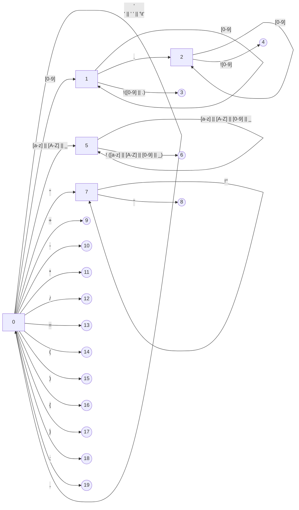
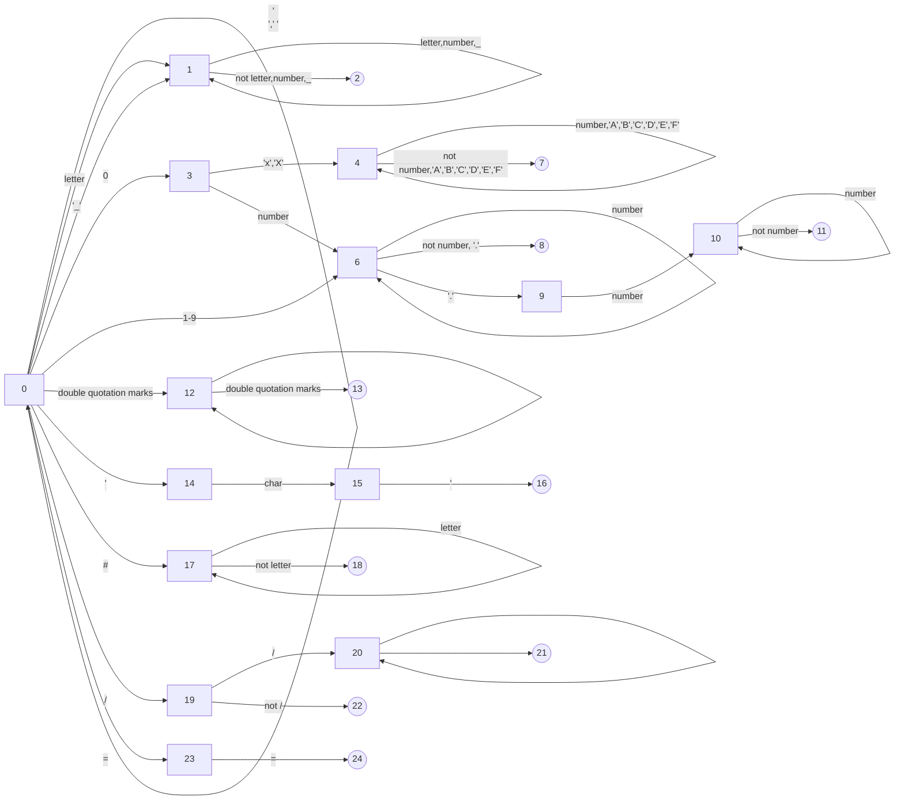

[TOC]

# Language


```
begin
int add(int a, int b)
{
	return a + b;
}

int c = add(5, 6);
float f = 0.56;

string s = "float";

print("5 + 6 = ", c, "\n", s, " = ", f);

end
```


# Lexical Analysis


## Key

- begin
- end
- return
- int
- float
- string
- print


## Token

<key, begin>

<key, end>

<key, return>

<key, int>

<key, float>

<key, string>

<key, print>

<id, _>

<plus, +>

<minus, ->

<times, *>

<division, />

<equal, =>

<lparenth, (>

<rparenth, )>

<lbrace, {>

<rbrace, }>

<semicolon, ;>

<comma, ,>


## NFA




# Syntactic Analysis


## Producrion


**T** :  { <key, begin>, <key, end> , <key, return>, <key, int>, <key, float>, <key, string>, <key, print>, <id, _>, <plus, +>, <minus, ->, <times, *>, <division, />, <equal, =>, <lparenth, (>, <rparenth, )>, <lbrace, {>, <rbrace, }>, <semicolon, ;>, <comma, ,>, $\phi$ }

**NT** : {P, ID, IDset, Func, Para, FuncP, FP}

**NT** : {P, D, A, F, R, P'}

S -> <key, begin> P

P -> P' | <key, end>

P' -> D | A | F | $\phi$


D -> T IDset 


A -> <id, _> <equal, => 


P -> <key, int> ID | <key, float> ID | <key, string> ID | <key, print> | <lparenth, (> | <lbrace, {> | <semicolon, ;>

ID -> <id, _> IDset | <id, _> Func


IDset -> <semicolon, ;> | <comma, ,> ID 


Func -> <lparenth, (> Para <lbrace, {> FuncP 


Para -> <id, _> <rparenth, )> | <id, _> <comma, ,> Para


FuncP -> <rbrace, }> | FP 


FP -> 


# Lexical Analysis


## c Lexical Analysis


### Token

|          regular expression           |  token-name   | attribute-value |            exmaple            |
| :-----------------------------------: | :-----------: | :-------------: | :---------------------------: |
| (\_\|[a-z])([a-z]\|[A-Z]\|[0-9]\|\_)* |      key      |                 |       int -> {key, int}       |
| (\_\|[a-z])([a-z]\|[A-Z]\|[0-9]\|\_)* |      id       |                 |    _value -> {id, _value}     |
|                [0-9]+                 |    integer    |                 |     015 -> {integer, 015}     |
|           (0x\|0X)([0-9])+            |      hex      |                 |      0x16 -> {hex, 0x16}      |
|             [0-9]+.[0-9]+             |     float     |                 |     0.60 -> {float, 0.60}     |
|                  ""                   |    string     |                 | "String" -> {string, String}  |
|                  ''                   |     char      |                 |       'a' -> {char, a}        |
|                   #                   |     macro     |                 | #include -> {macro, #include} |
|                   {                   |    lbrace     |        {        |                               |
|                   }                   |    rbrace     |        }        |                               |
|                   [                   |   lbracket    |        [        |                               |
|                   ]                   |   rbracket    |        ]        |                               |
|                   (                   |   lparenth    |        (        |                               |
|                   )                   |   rparenth    |        )        |                               |
|                   <                   |    langle     |        <        |                               |
|                   >                   |    rangle     |        >        |                               |
|                   ;                   |   semicolon   |        ;        |                               |
|                   :                   |     colon     |        :        |                               |
|                   ,                   |     comma     |        ,        |                               |
|                   .                   |      dot      |        .        |                               |
|                   ?                   |   question    |        ?        |                               |
|                   !                   |  exclamatory  |        !        |                               |
|                   *                   |     start     |        *        |                               |
|                   \                   |    escape     |        \        |                               |
|                  //                   |    comment    |                 |                               |
|                   +                   |     plus      |        +        |                               |
|                   -                   |     minus     |        -        |                               |
|                   /                   |     slash     |        /        |                               |
|                   &                   |      and      |        &        |                               |
|                  \|                   |      or       |                 |                               |
|                  &&                   |     dand      |                 |                               |
|                 \|\|                  |      dor      |                 |                               |
|                   =                   |     equal     |        =        |                               |
|                  ==                   |    dequal     |       ==        |                               |
|                  !=                   |    nequal     |       !=        |                               |
|                  <=                   |    lequal     |       <=        |                               |
|                  >=                   |    gequal     |       >=        |                               |
|                  ++                   |     dplus     |       ++        |                               |
|                  --                   |    dminus     |       --        |                               |
|                  >>                   |    lshift     |       >>        |                               |
|                  <<                   |    rshift     |       <<        |                               |
|                  +=                   |   plusequal   |                 |                               |
|                  -=                   |  minusequal   |                 |                               |
|                  <<=                  |  lshiftequel  |                 |                               |
|                  >>=                  |  rshiftequel  |                 |                               |
|                  *=                   |  timesequal   |                 |                               |
|                  /=                   | divisionequal |                 |                               |
|                                       |               |                 |                               |


### State

0 : blank

2 : id

4 : integer

7 : hex

8 : int

11 : float

13 : string

16 : char

18 : macro

21 : comment

22 : slash

24 : 

### NFA




